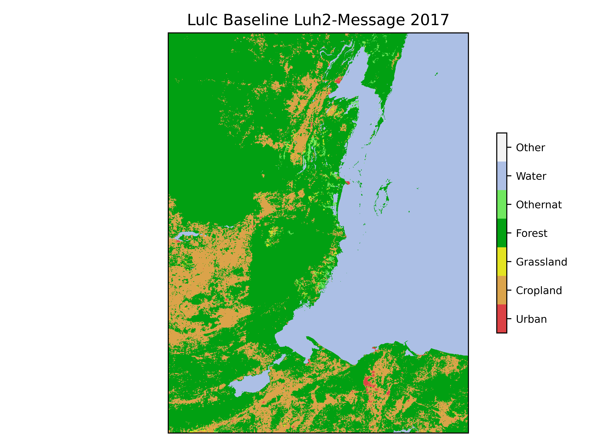
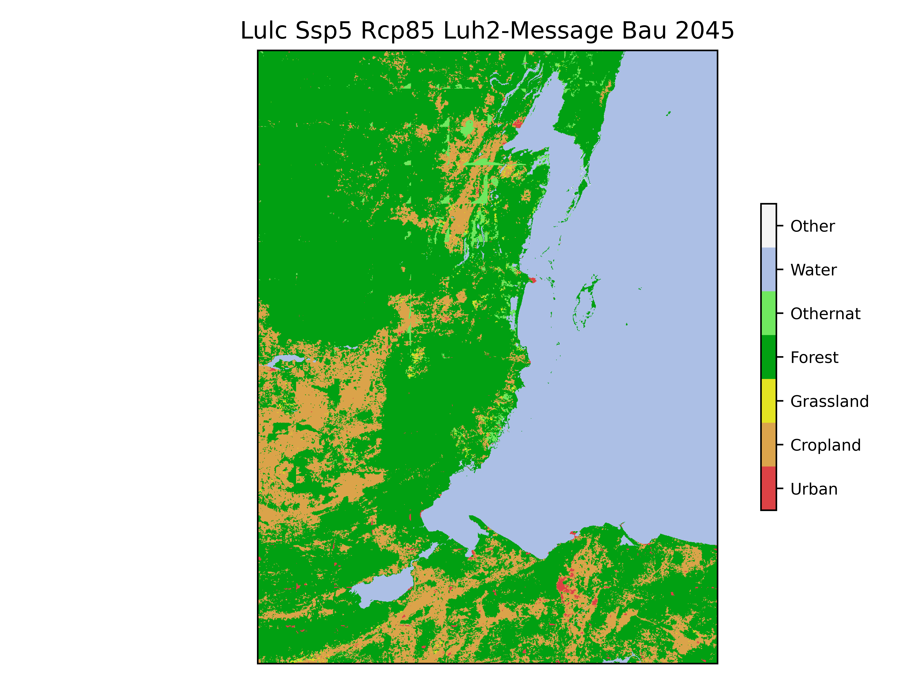
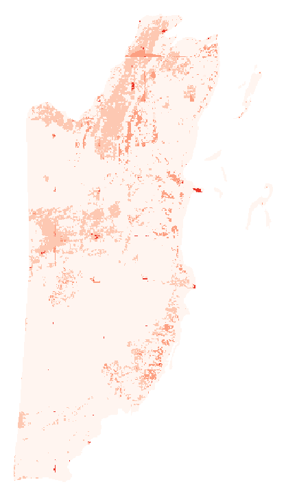
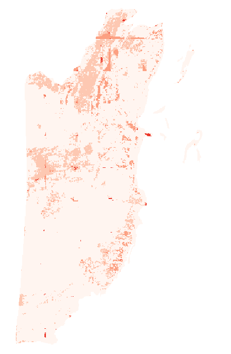
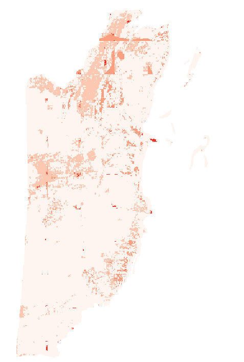
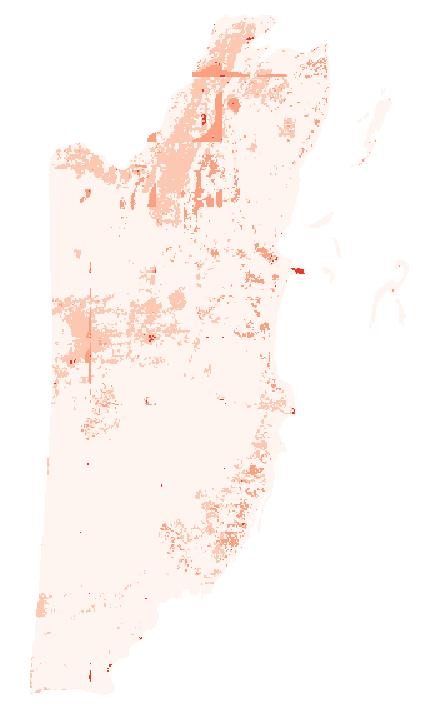
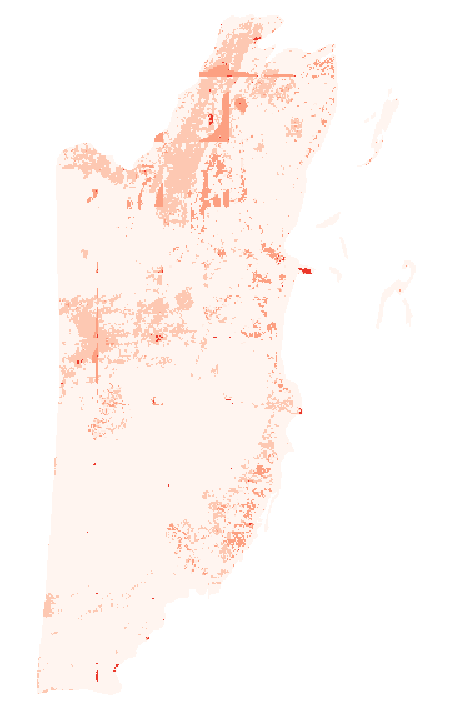
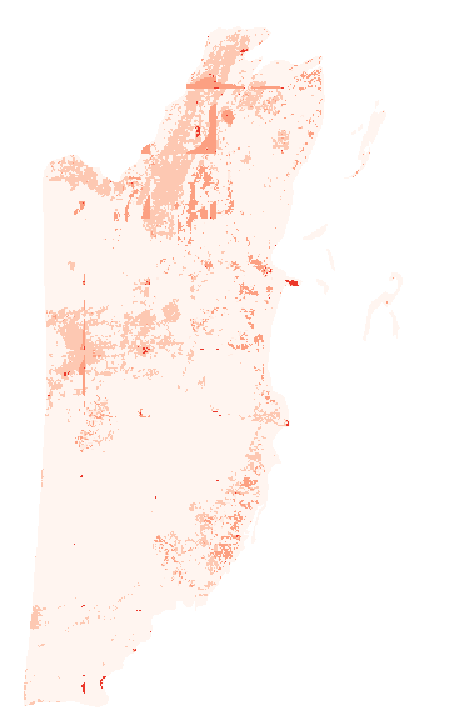

# Earth Economy Modeling for APEC ENV 8601 -- Natural Resources
### Country: Belize

# Description: 
This project is an application of the GTAP-InVEST earth economy modeling approach to estimate global-local-global estimates of the influence of ecosystem services on a computable general equilibrium of a national economy. Below are the main steps performed in this analysis as well as a discussion of the results. 

## Step 1

### Use SEALS to generate a LULC map for 2030, 2035, and 2040. Estimate this for SSP2 and SSP5.

To change the input definitions for the SEALS standard run, I need to modify the `scenario_definitions.csv` file called on line 62 of the `run_test_standard.py`: `p.scenario_definitions_path = os.path.join(p.input_dir, 'scenario_defininitions.csv')`. Under `aoi`, I changed the country alpha-3 code to BLZ for Belize. The scenerios are already set to baseline and SSP2 under `exogenous_label`. Here I duplicate a line from SSP2 to create SSP1 and SSP5 while removing SSP2. To modify the years that SEALS generates the LULC maps, I insert `2030 2035 2040` under `years` for the SSP1 and SSP5 scenerios while keeping the baseline year at 2017 (this is the baseline year of data that SEALS is pulling from -- so don't change). Note that the labels in the scenerio definitions are important. So be sure to relabel them consistently as shown in the `scenario_definitions.csv` file in this repo. 

Finally, to run the new SSP scenerios you will need to download the correct `coarse_projections_input_path` from [Land Use Harmonization data](https://luh.umd.edu/data.shtml). You will need to approriately save this in the `base_data` using a consistent directory structure from the baseline input data. 

For `hazelbean` to run parallel processing, it creates separate project folders given the name given in line 24. If you don't change the name, `run_test_standard.py` will throw an error. So, instead create a new file for the Belize run called `run_BLZ_standard.py` and change `project_name = 'BLZ_standard'`

Once completed I now I have a new set of scenerio definitions which I an use in the [run_BLZ_standard.py](./seals/run_BLZ_standard.py). You can examine this file as [scenario_defininitions1a.csv](./seals/projects/BLZ_standard/input/scenario_defininitions1a.csv). To examine the results, you can now look in the `seals` folder under `projects` and you should find the LULC maps (and other output) in a folder called `BLZ_standard` alongside the initial folder for the initial test run called `test_standard`.

You will want to put the `scenario_definitions.csv` file into a new project folder labeled `BLZ_standard\input` before running the `run_BLZ_standard.py`. If you do not, then it will populate the standard test run with Rwanda instead of the new country (Belize). When you go to run this script, run it within the Debug function with VSCode using the internalConsole. Make sure to working within the `earth_economy_devstack (Workspace)` and to run with your `teem_devstack` python kernel so you have all the correct modules. 

### Plot these seven LULC maps and scenerios.

#### LULC 2017 with Baseline (SSP2)

#### LULC 2030 with SSP1

#### LULC 2030 with SSP5

#### LULC 2035 with SSP1

#### LULC 2035 with SSP5

#### LULC 2045 with SSP1

#### LULC 2045 with SSP5

### Add a new policy layer preventing or encouraging a type of land-use change. 

I implement a policy that supposes that there are no conservation requirements. This is to say that protected areas can be converted to any land use type. To apply this policy, I edit the `strict_pa` attribute of the `default_global_coefficients.csv` from the seals base data. This change can be found in the attached [default_global_coefficients.csv](./base_data/seals/default_inputs/default_global_coefficients.csv) file. Below are the LULC as a result of this change. 

#### LULC 2017 with Baseline (SSP2)

#### LULC 2030 with SSP1

#### LULC 2030 with SSP5

#### LULC 2035 with SSP1

#### LULC 2035 with SSP5

#### LULC 2045 with SSP1

#### LULC 2045 with SSP5

### Provide a narrative of how the different scenerios changed when this land use class was expanded or contracted. 

The SSP1 scenario had far more change than the SSP5 scenario; which was suprising. The main finding was that if we stay in a world of conservation, nature will expand in several areas of Belize. This is to suggest that urbanization and crop expansion in Belize has a minimal likilihood to increase under any SSP scenerio. But, Belize is an important area where natural captial could expand if we maintain a more enviornmental SSP. 

## Step 2

### Using the first set of LULC maps from SEALS, assess ecosystem service provision for carbon storage, water yield, pollination, sediment retention, and nutrient retention using the InVEST ecosystem service modeling. 

I use the LULC maps generated through SEALS as inputs to assess ecosystem service provision through the InVEST model. Before using the generated LULC maps in the InVEST to compute the ecosystem services, we need to make sure that the projection systems used in the maps are confirmable. The SEAL output uses WGS84 and INVEST uses EPSG:5235. Another commonly used and preferred projection system is Robinson projection (ESRI:54030).  Additionally, to run the five InVEST models you need to collect the global input data required for each process based model from Chaplin-Kramer et al. "Global modeling of nature’s contributions to people".

The input base data for the InVEST models can be found in the [base-data folder](./base_data/invest/). To create the following images, you can run the `run_invest_BLZ.py` script. 

### Show the plots for these ecosystem services

#### Ecosystem Service: Carbon Storage

##### SSP1 2030 

##### SSP1 2035

##### SSP1 2045 

##### SSP5 2030 

##### SSP5 2035

##### SSP5 2045 

#### Ecosystem Service: Pollination

#### Ecosystem Service: Sediment Retention

#### Ecosystem Service: Nutrient Retention

#### Ecosystem Service: Water Yield (Supply)

### Describe how the various scenerios differ with respect to the different ecosystem services. 

Here I discuss what visually increases and decreases. Are there hotstops in the country?

### Write an executive summary for what the policy maker interested in "green economic development" should know. 

Here is my executive summary. Avoid SSP5 as a counterfactual. value in ...

## Step 3 

### Post and organize code from this semester. Add a README.md 

This README file so far has described the final project analysis and the results. In addition, for the APEC 8601 natural resource course, we produced some empirical results using python code. I elaborate on this below. 

- In [problem set 02](./problem_sets/problem_set_2_mcway.pdf) I work with the DICE model for optimal production considering the damages from global warming. Additionally, I work with the MAGICC model to show the projected global temperature under different RCP scenerios through 2100.
- In [problem set 04](./problem_sets/problem_set_4.pdf) I run the InVEST ecosystem services model to estimate the ecosystem service benefits from crop pollination. 

### Make the repository public. Submit Repo to Canvas.

This repository has been made public and can be found [here](https://github.com/mcwayrm/env8601_project).

### Here is a list of other versions of this project from colleagues in this course: 

- [Malaysia - Tianhao Zhou](https://github.com/Tianhao02/APEC8601)
- [Sri Lanka - Subin Poudel](https://github.com/subinpoudel/Earth-Economy-Modeling-of-SriLanka)
- [Ghana - Matt Braaksma](https://github.com/m-braaksma/apec8601_project)
- [ - Shunkei Kakimoto](https://github.com/Shunkei3/final_assignment)
- [ - Prayash Pathak](https://github.com/prayash106/a-pec_8222_prayash_pathak)
- [ - Jacob Harris](https://github.com/harr2887?tab=repositories)
- [ - Yuheng Du]()
